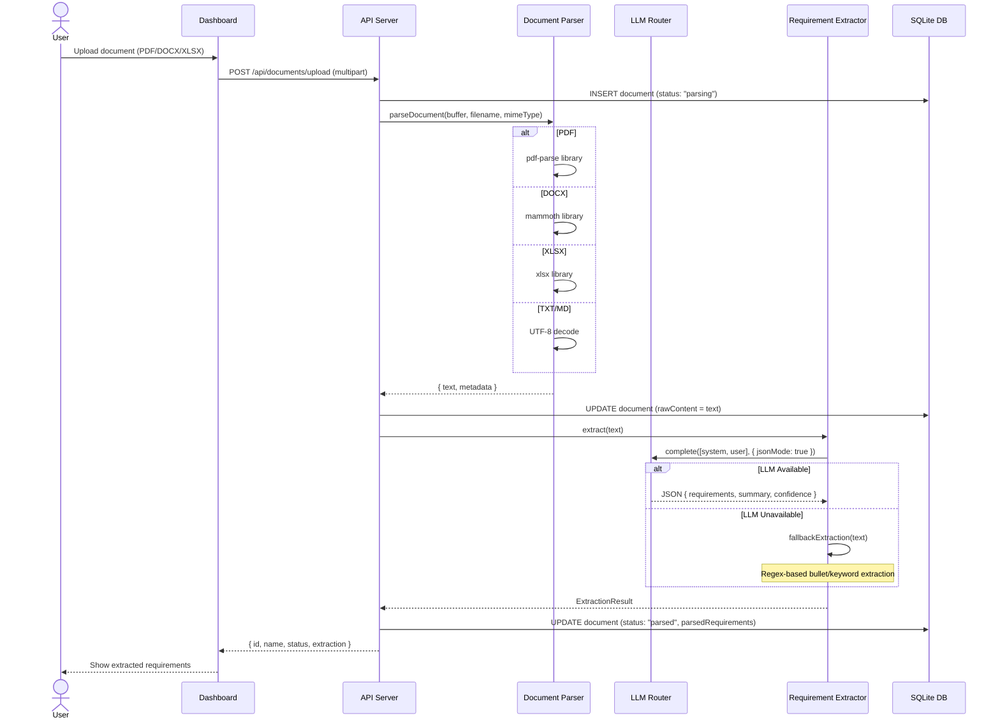
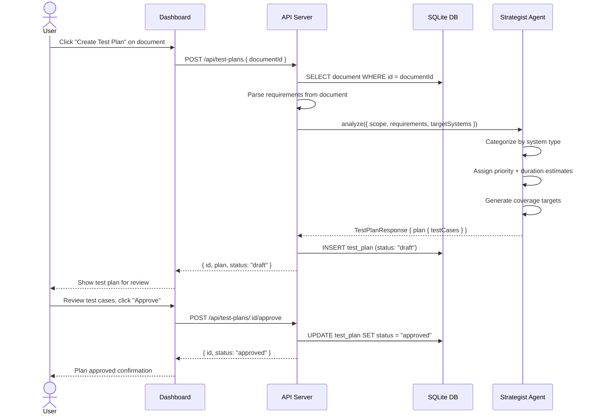
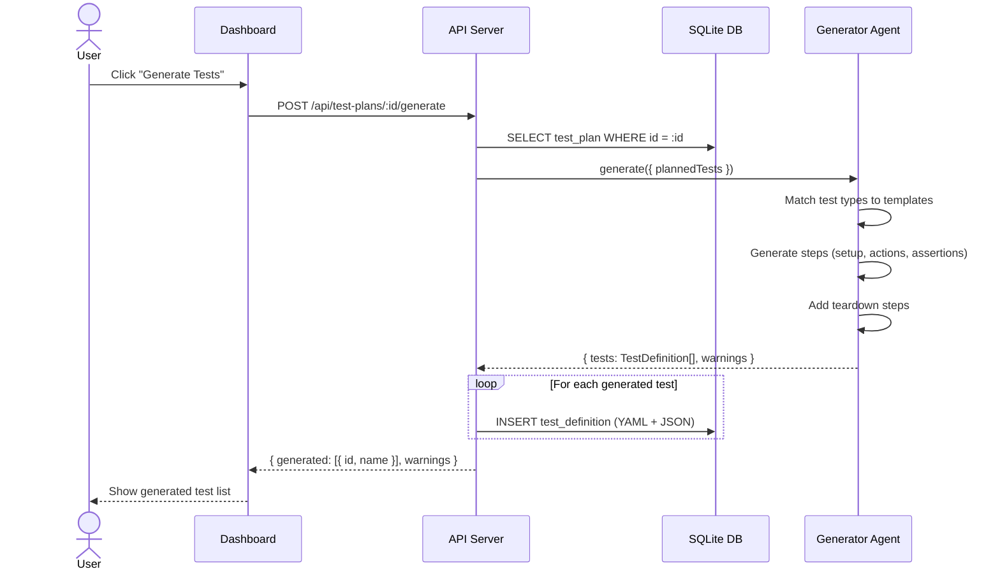
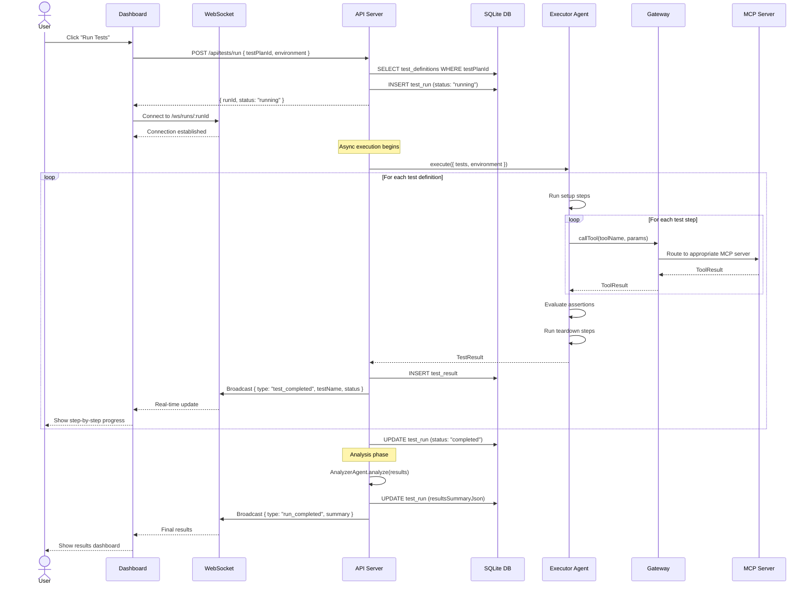
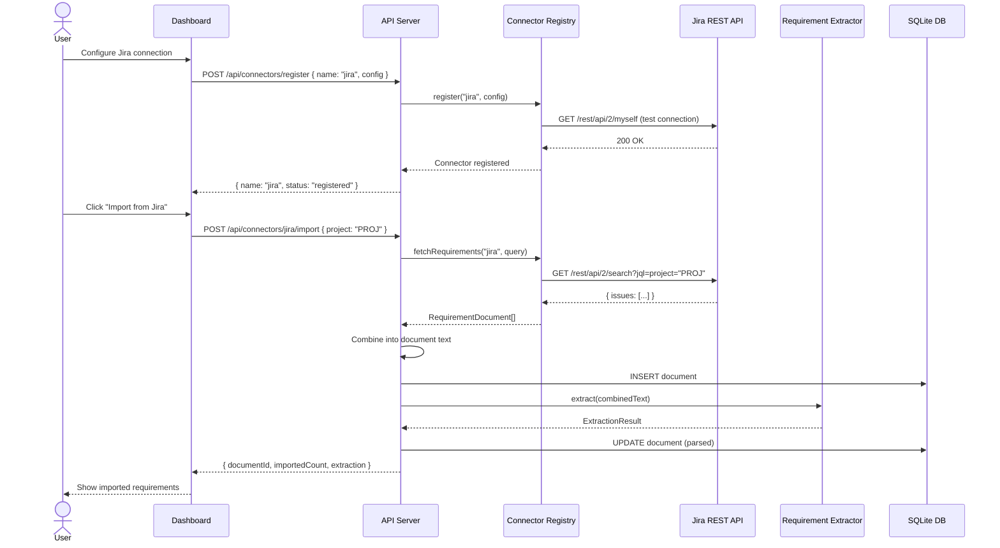
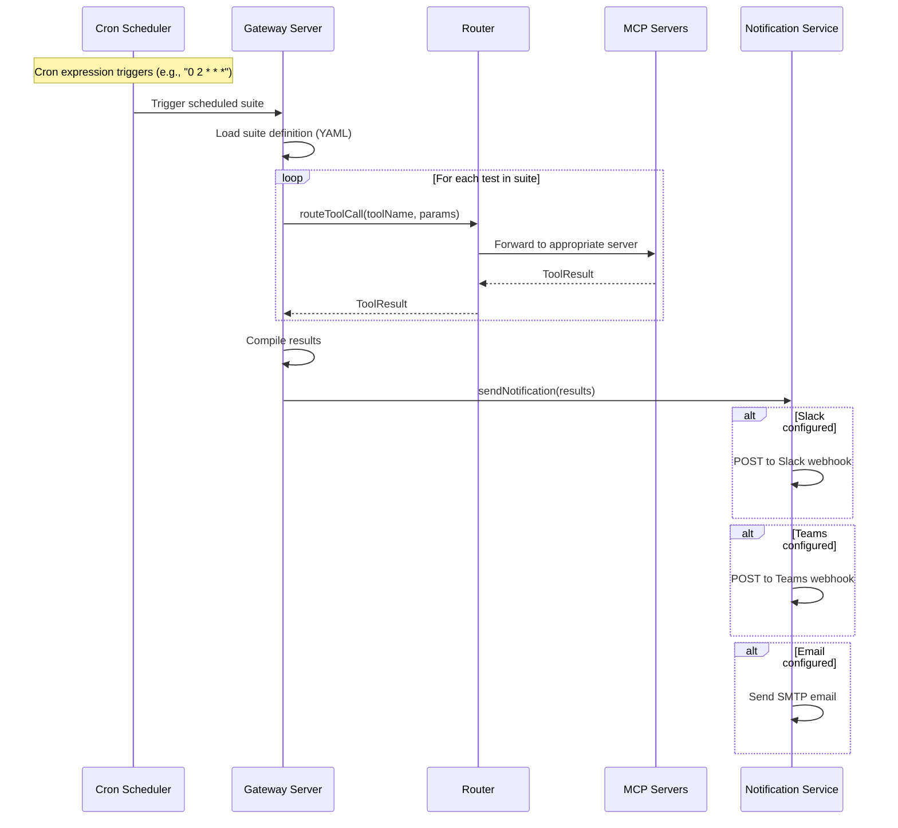
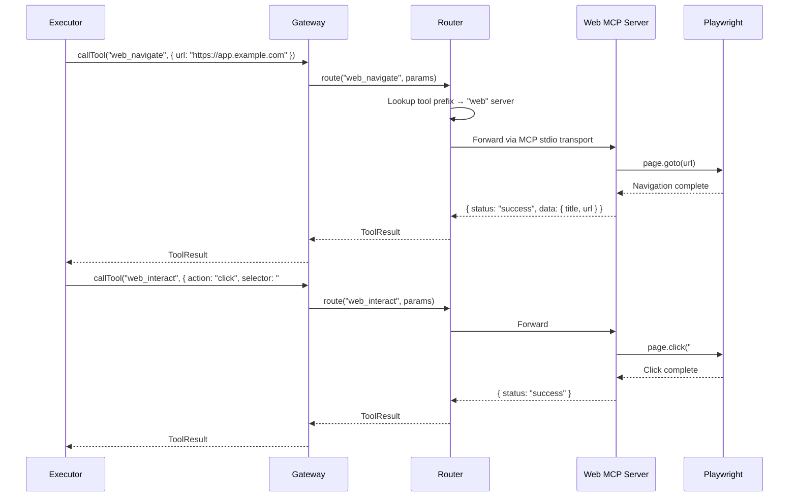
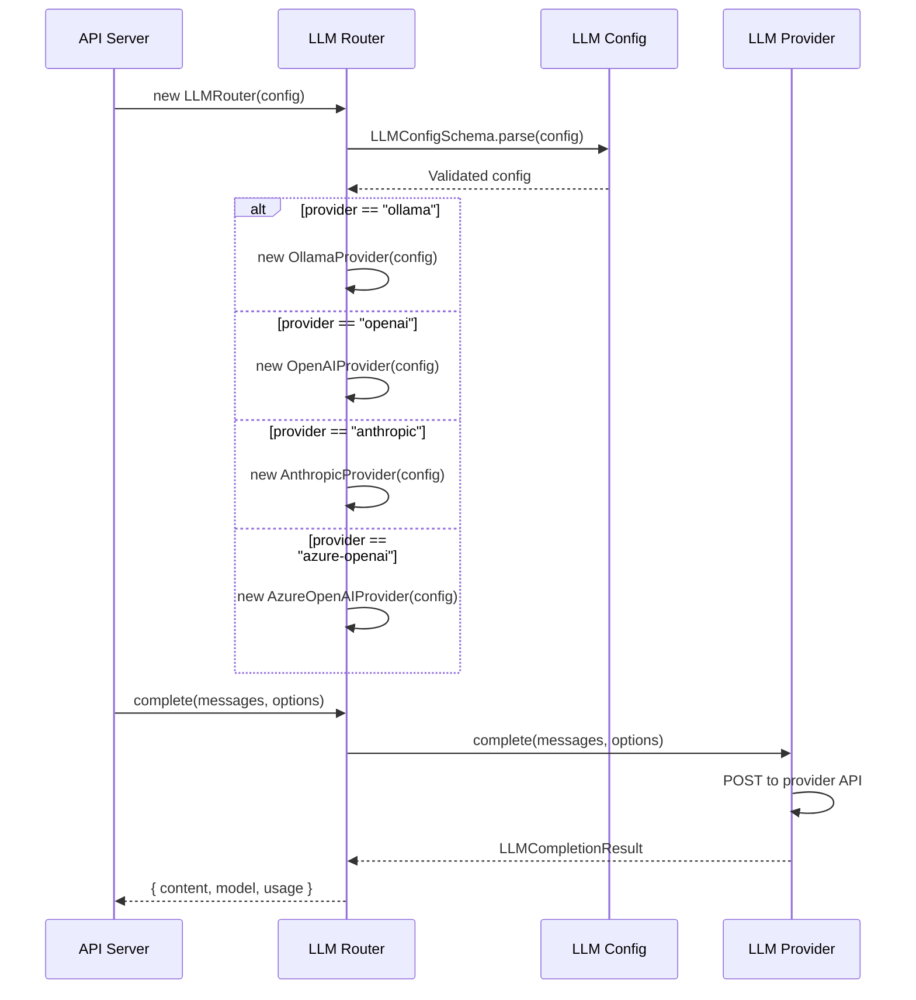

# Sequence Diagrams

## Test Automation MCP Platform

**Version:** 0.1.0
**Last Updated:** February 2026

---

## 1. Document Upload and Requirement Extraction

---

## 2. Test Plan Generation and Approval

---

## 3. Test Generation from Approved Plan

---

## 4. Test Execution with Live Updates

---

## 5. Connector Import (Jira Example)

---

## 6. Scheduled Test Execution

---

## 7. MCP Tool Execution Detail

---

## 8. LLM Provider Selection

